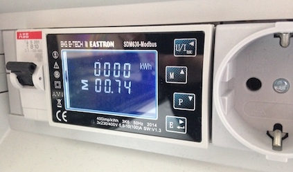
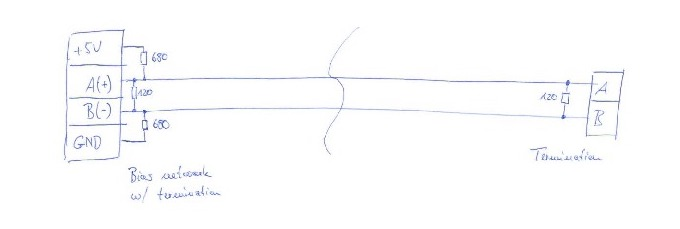

# A HTTP interface to the SDM630-MODBUS smart meter

This project provides a http interface to the Eastron SDM630 smart
meter. The device comes in many flavour - make sure to get the "MODBUS"
version. The SDM630-MODBUS exposes all measured values over an RS485
connection, making it very easy to integrate it into your home
automation system.

## How does it look like in OpenHAB?

TODO

## Installation

The installation consists necessarily of a hardware and a software part.
Make sure you buy/fetch the following things before starting:

* A SDM630 smart meter, the MODBUS version.
* A USB RS485 adaptor. Mine is from Digitus.
* Some cables to connect the adapter to the SDM630 (for testing, I use
an old speaker cable I had sitting on my workbench, for the permanent
installation, a shielded CAT5 cable seems adequate)
* Two 120 Ohm and two 680 Ohm resistors (1/4W metal).

### Hardware installation



First, you should integrate the SDM630 into your fuse box. Please ask a
professional to do this for you - I don't want you to hurt yourself!
Refer to the SDM630 installation manual on how to do this. You need to
set the MODBUS communication parameters to ``9600 8N1``. I obtained my
SDM630 from the German distributor [B+G
E-Tech](http://bg-etech.de/os/product_info.php/cPath/25_28/products_id/50).

After this you need to connect the USB adaptor to the SDM630. This is
how I did the wiring:



I got this [Digitus USB-RS485
adaptor](http://www.digitus.info/en/products/accessories/adapter-and-converter/r-usb-serial-adapter-usb-20-da-70157/)
which comes with a handy terminal block. I mounted the [bias
network](https://en.wikipedia.org/wiki/RS-485) directly on the terminal
block:


### Installing the software from source

You need a working [Golang installation](http://golang.org) and the [GB
build tool](http://getgb.io/) in order to compile your binary. You can
install GB like this:

    go get github.com/constabulary/gb/...

Afterwards you clone this repository:

    git clone https://github.com/gonium/gosdm630.git

and build it:

    gb build all

Now, there should be a binary in the ````bin```` subfolder.
